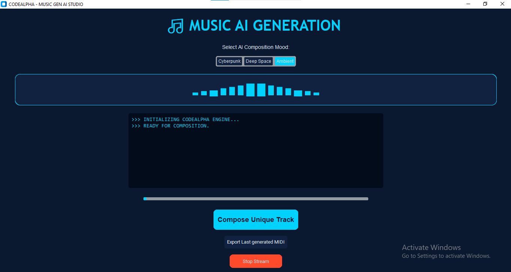

# 🎵 NOOR AI: NEURAL MUSIC GENERATION ENGINE

### *CodeAlpha Artificial Intelligence Internship - Task-3*

## 🤖 Project Overview

This project is an advanced Music Generation AI developed during my internship at CodeAlpha. It utilizes Deep Learning to learn musical patterns and compose unique MIDI tracks based on user-selected moods. The application is wrapped in a high-end, modern desktop interface with real-time visualizers.

## ✨ Key Features

🧠 Deep Learning Engine: Employs an AI model to generate complex MIDI note sequences.

🎵 Dynamic Moods: Choose between Cyberpunk (Dark/Fast), Deep Space (Ambient/Melodic), and Ambient (Soft/Calm).

🎨 Modern UI/UX: A sleek Soft Neon Blue theme built with CustomTkinter.

📊 Real-time Visualizer: Dynamic waveform bars and typewriter-style lyrics that sync with the AI stream.

💾 MIDI Export: Allows users to save and export AI-generated tracks directly to their local machine.

✨ Neon Interactivity: Buttons and titles feature soft-glow blinking effects for an immersive experience.

 ## 🛠️ Tech Stack

Language: Python 3.11

AI/ML: TensorFlow (Keras LSTM patterns)

Audio Engine: Pygame (Mixer) & Music21 (MIDI Processing)

Interface: CustomTkinter (Modern Desktop UI)

Data Handling: NumPy

Special thanks to @CodeAlpha for this amazing learning opportunity!

## 📸 Interface Preview

## 🚀 Installation & Usage

1. **Clone the Repository**:

Bash
git clone https://github.com/noorfatimaimran/CodeAlpha_Music_Generation.git
Install Dependencies:

Bash
pip install -r requirements.txt
Run the App:

Bash
python main_app.py

📂 Project Structure

main_app.py: The core application and UI logic.

cyberpunk_music_model.h5: The trained AI model.

requirements.txt: List of necessary Python libraries.

README.md: Documentation (this file).

👩‍💻 Developed By

Noor Fatima Aspiring AI Developer & Computer Science Student
